# SS_Web Mario

### Introduction
This is a web mario game created by typescript, Tiled and Cocos creator.

### Scoring

| **Basic components** | **Score** | **Check** | **Detail** |
| :------------------- | :-------: | :-------: | :--------- |
| Complete Game Process   |    5%    |     Y     |  |
| World Map   |    10%    |     Y     | Level 0 map |
| Level Design   |    5%    |     Y     | static wall && question block |
| Player           |    20%    |     Y     | | 
| Enemies       |    15%     |     Y     | Turtle enemy * 1|
| Question Blocks       |    5%     |     Y     | supermushroom block * 1 && coin block * 1 | 
| Animation       |    10%     |     Y     | Enemy animation : <br>- turtle_walk <br>- turtle_die <br>- turtle_spin |
| Sound Effects       |    10%     |     Y     | Additional sound effects : <br>- kick.wav ( when killing turtle )<br>- loseOneLife.wav ( when player dies )<br>- powerUpAppear.wav ( when hitting the supermushroom question block )<br>- PowerUp.mp3 ( when player eats the supermushroom )<br>- powerDown.wav ( when player turns from big mario to small )<br>- coin.wav ( when player hits the coin question block )
| UI       |    10%     |     Y     | player life, score and timer |

| **Bonus**     | **Score** | **Check** | **Detail** |
| :--------------------- | :-------: | :-------: | :---------: |
| Firebase |   5%     |     Y?     | only firebase deploy |

### How to play
The whole game process includes Start, Level select, Game Start, Game Over, Level 0 sceneces.

#### 1. Start Scene
There is bgm ( bgm_2.mp3 ) playing and user could press "START" button to enter level select scene.

<p>
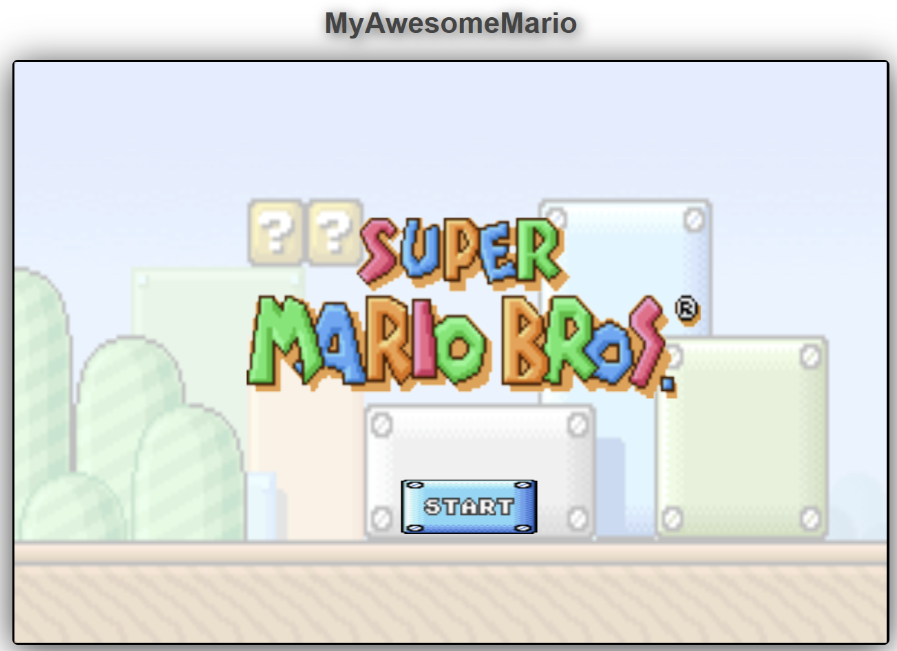
</p>

#### 2. Level Select Scene
It has player info area and the below button area. bgm ( bgm_1.mp3 ) is playing in the background.

##### Player Info
This area shows information of player life, coin, score.

##### Button area
"Back" button leads the player back to the **Start Scene**, while "Level 0" takes player to **Game Start**.

<p>
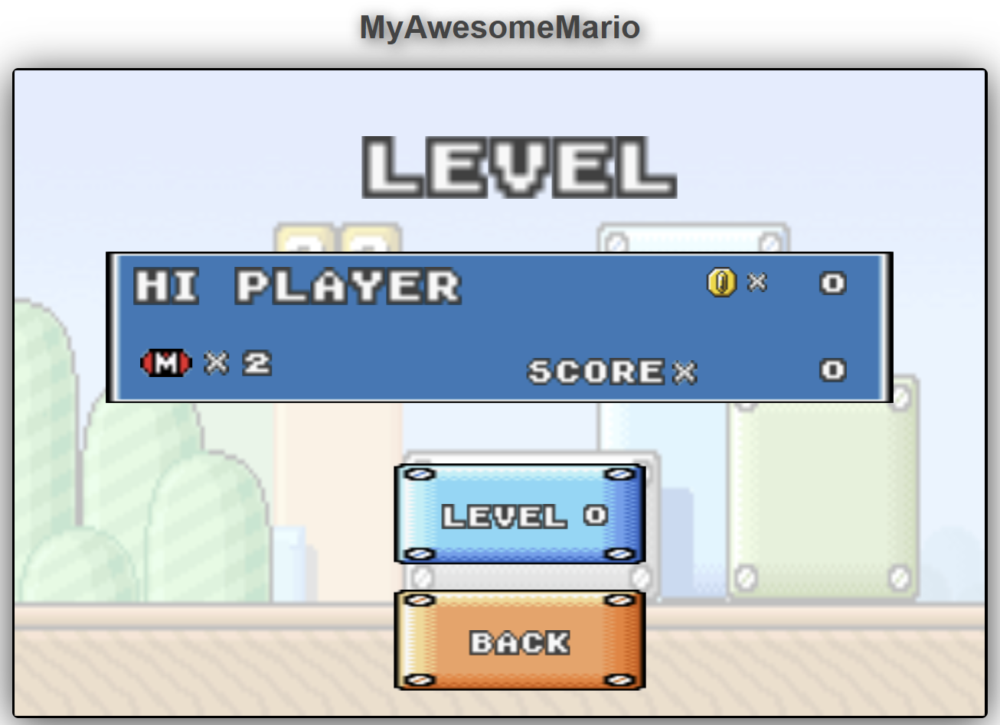
</p>

#### 3. Game Start Scene
This scene informs user the game is about to start, it would transform to Level 0 scene after 3 seconds.

<p>
    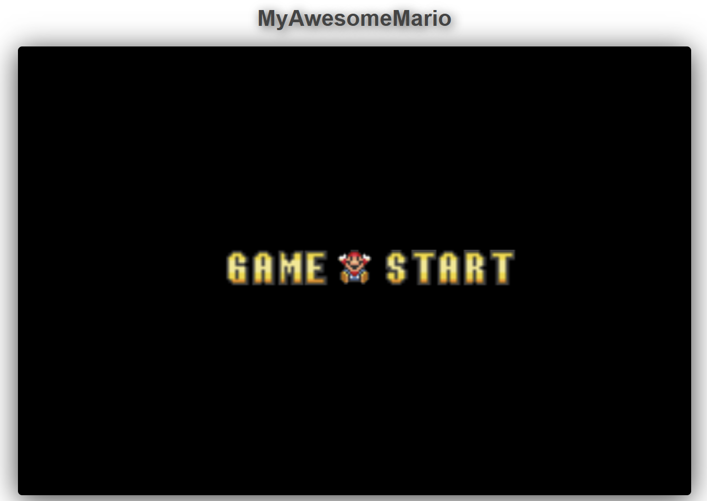
</p>

#### 4. Level 0 Scene
This is the main game scene with map and mario for player to control.
<p>
    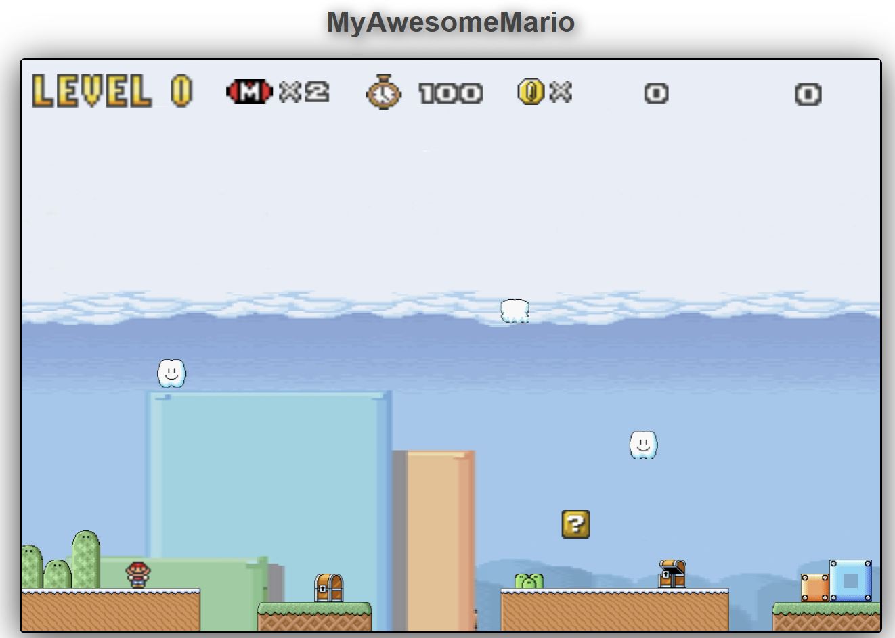
</p>

##### (1) UI
UI is fixed on the upper part of the scene. It shows the Level 0 title, player lives, coins, and score.

##### (2) Map
* ground
* static wall <br>
**hint : ONLY blocks and chimney static walls, others are background, player CANNOT interact with them**

* question blocks <br> ( see **(3) Player -- Mario** interact with question block part )
    * supermushroom question block
    * money question block

##### (3) Player -- Mario
* control
User could press **up, left, right on the keyboard** to control the mario character to jump, walk left, walk right in the game. <br>
User **could NOT jump continuously** with controlling mario. And the mario would die when falling out of bound or having contact with the enemy turtle.

* walk animation <br>
* jump animation <br>
    <p>
    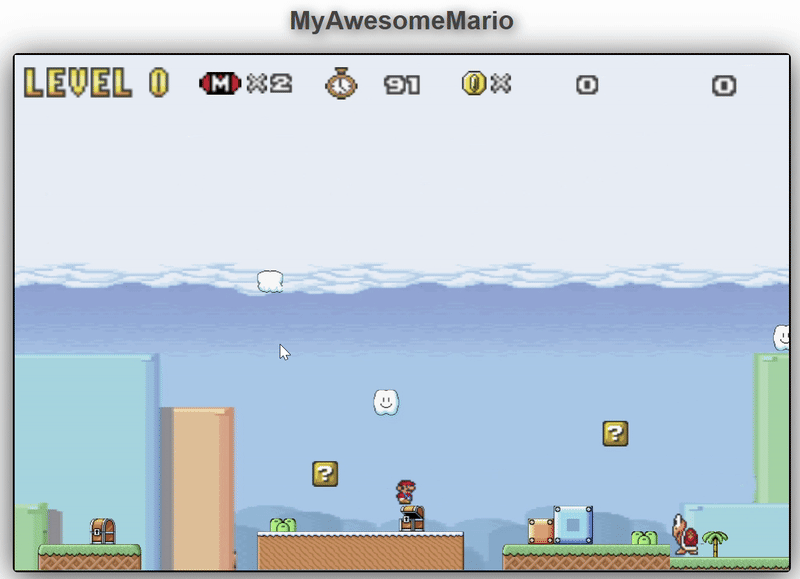
    </p>
* die animation <br>
    <p>
    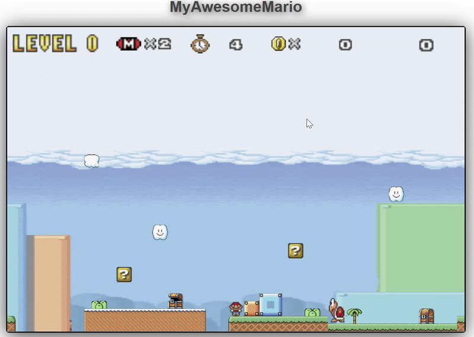
    </p>

* interact with question block <br>
Player could gain 100 score when hitting on the block, and the block could only be triggered from **hitting it below**. <br>
However, the bgm and mushroom / coin would **NOT** be triggered after already triggered once. <br>
When the player eats supermushroom, the player would turn big.
    <p>
    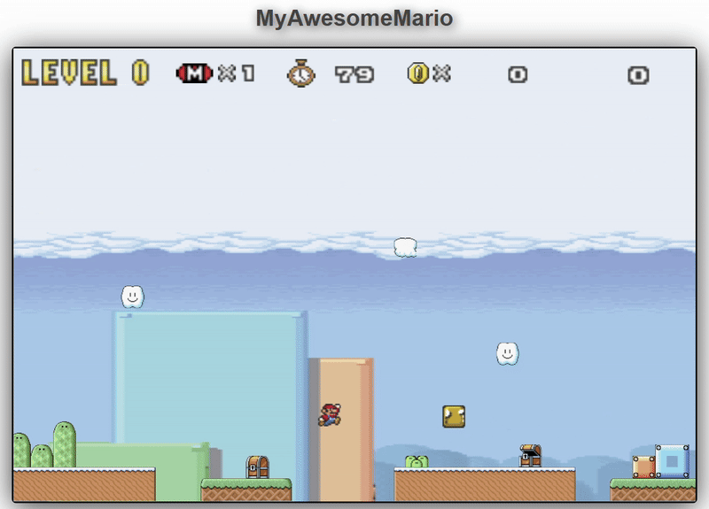
    </p>

* interact with enemy <br>
Player would die when contacting the enemy not from the head of the enemy when it is small mario. If it contact with the enemy when the big state, it would only turn back to small mario rather than lose one life. <br>
Player could kill the enemy by hitting it from the head, this would gain 200 for the player's score.<br>
Then, the turtle enemy would turn to only shelves and maintain still for 5 seconds, and the enemy would start spinning. In this state, **no matter where the player contact with the turtle the player would be harmed**.

<p>
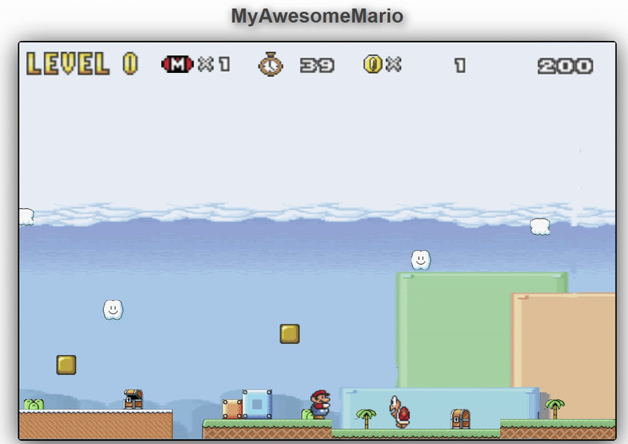
</p>
<p>
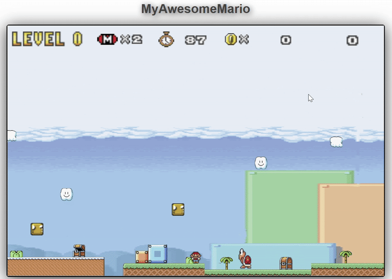
</p>

* turn big <br>
    * big mario walk animation <br>
    * big mario jump animation <br>
    <p>
    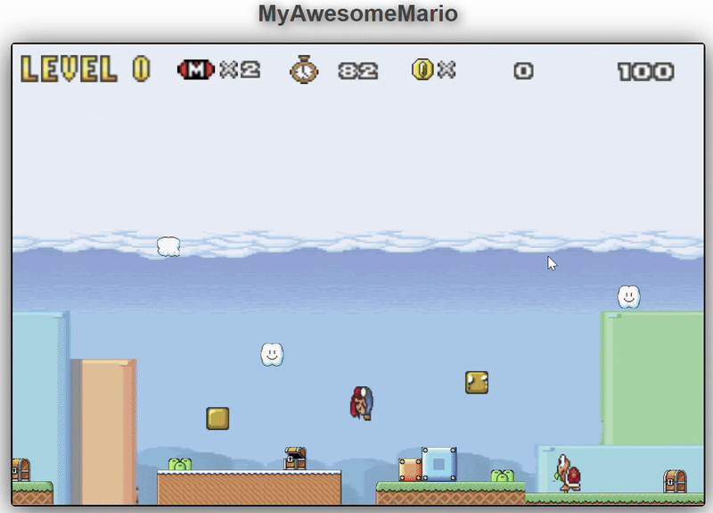
    </p>
    * Invincible time <br>
    Since big mario would not die immediately, it would turn back to small mario when getting harmed first. It would be invincible after turing into small mario for 1.5 seconds, the invincible time would end and inform the player by flashing mario.
    <p>
    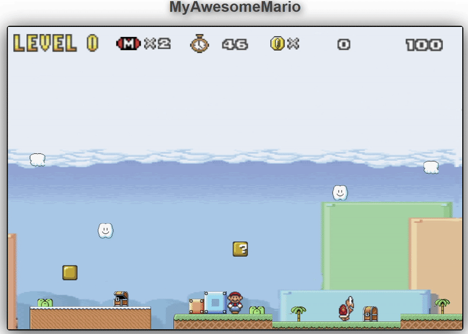
    </p>

##### (4) Enemy -- Turtle
The enemy would move back and forward ( turning directions because collide with the wall ) in the area.<br>
( see **(3) Player -- Mario** part ) <br>
* walk animation <br>
* die animation <br>
* spin animation <br>
* interact with player <br> 

##### (5) Level Clear
Player could clear level 0 by arriving the area of "flag". Then, it would calculate the score by the formula.
```
score = previous score added in this stage + (time left * 50)
```
This state would **block keyboard input** and jump to **Start Scene** 10 seconds after automatically.

<p>
    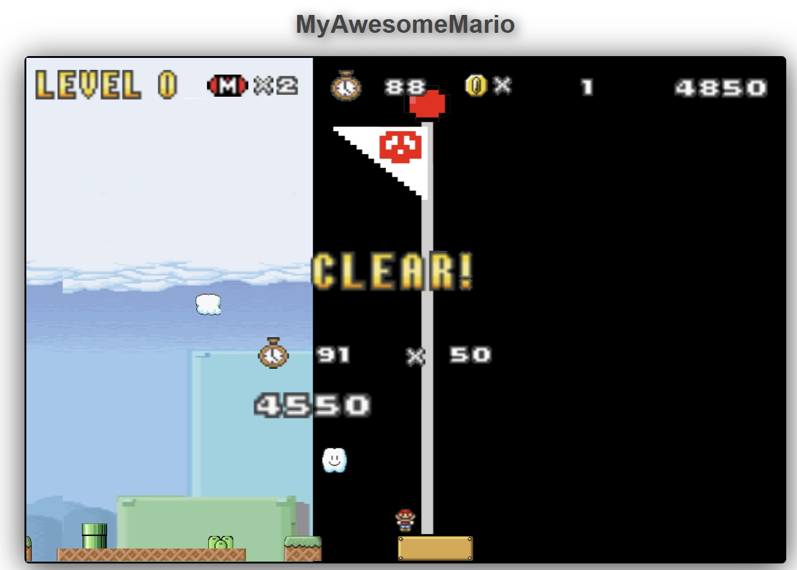
</p>

##### (6) Game process
* Player Fail <br>
Player would lose the game after losing all 2 lives. Then, it would lead to the **Game Over Scene**.
If player still have life, then the game would minus 1 life and jump to **Game Start Scene** to start the Level 0 again.

* Level Clear <br>
Player could clear the level by arriving the flag area. Then it would show the information ( score calculation ) in this round. ( see **(5) Level Clear** )

#### 5. Game Over Scene
The scene that would appear after the player lose all 2 lives. Press "Back" button would lead user to **Start Scene**.
<p>
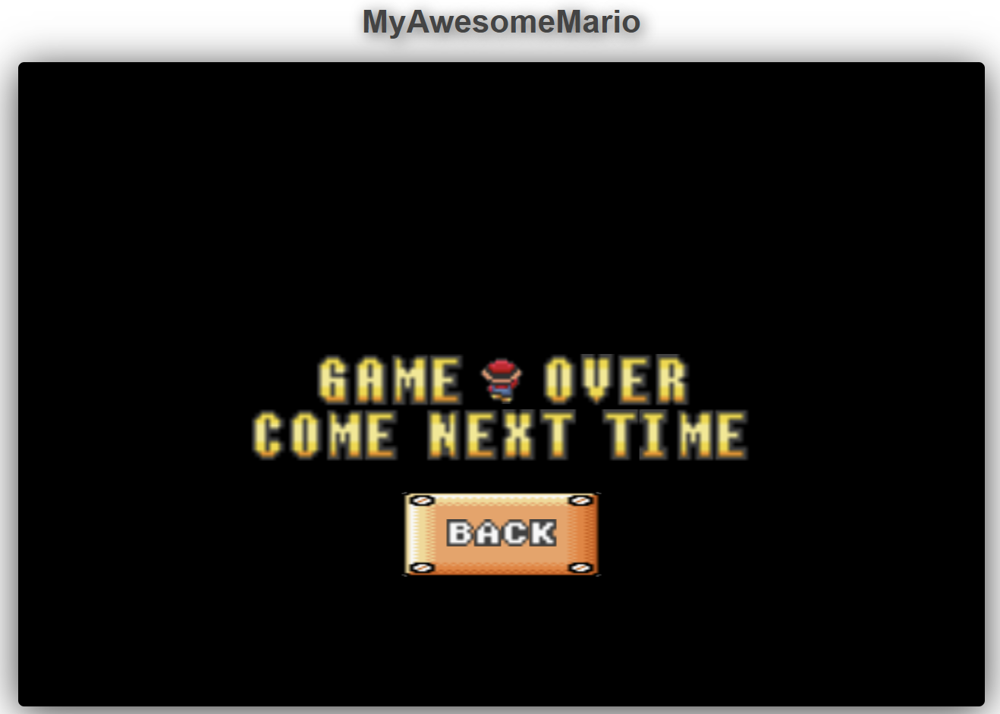
</p>


### Web Link
```
https://myawesomemario.web.app/
```
